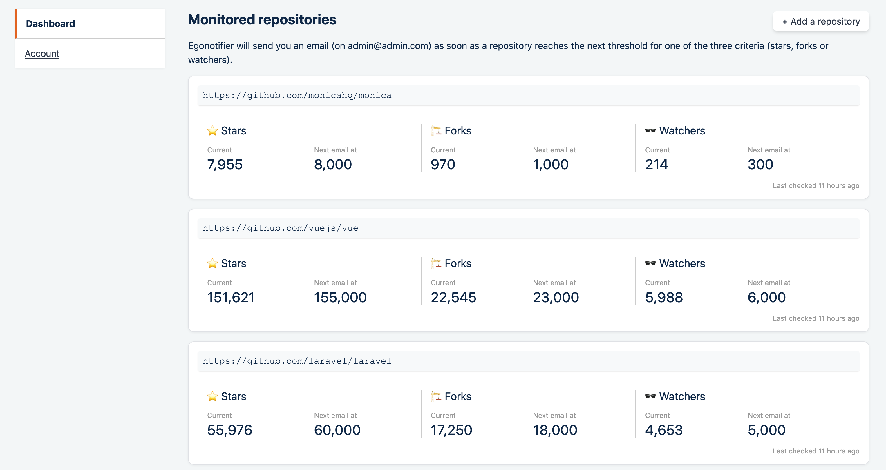

<div align="center">
    
</div>

<div align="center">
    <strong>Egonotifier monitors repositories you care about and sends you an email when they reach new milestones.</strong>
</div>

<div align="center">
    
</div>

## System requirements

* Yarn
* PHP 7.2+,
* Composer
* Web-server (Nginx or Apache2)
* Database (MySQL/MariaDB or PostgreSQL)
* Redis

## Installation and usage

Once the repository is pulled, you have a couple of commands to run:

```
composer install
php artisan migrate
yarn
mv .env.example .env
php artisan key:generate
```

Then, edit the `.env` file at your leisure:
* pay attention to the mail server's settings so emails are actually sent,
* grab a Github personal token so you can query Github's database.

Once everything is setup, you also need to configure a cron on your machine so it runs `php artisan schedule:run` every minute.

## Contributing

Please see [CONTRIBUTING](CONTRIBUTING.md) for details.

## License

The MIT License (MIT). Please see [License File](LICENSE) for more information.
